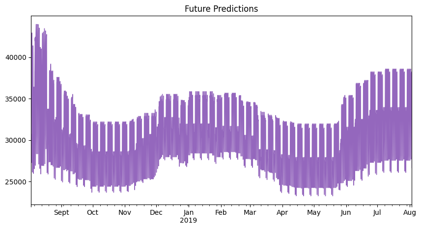

# Time Series Forecasting for Energy Consumption using XGBoost




## Project Overview

This project demonstrates a complete workflow for time-series forecasting using Python, Pandas, and XGBoost. The goal is to predict hourly energy consumption for the PJM East (PJME) region. The process covers everything from exploratory data analysis (EDA) and feature engineering to model training, evaluation, and visualization of the forecast.

This project is useful for anyone interested in learning how to apply machine learning techniques to time-series data. It provides a practical example of how to handle temporal features and leverage a powerful gradient boosting model like XGBoost for accurate predictions.

### Key Methods Used:
*   **Exploratory Data Analysis (EDA):** Visualizing the time series to understand its patterns, trends, and seasonality.
*   **Feature Engineering:** Creating time-based features (hour, day, month, year, etc.) from the timestamp.
*   **XGBoost Modeling:** Training an `XGBRegressor` model to learn the relationship between the engineered features and energy consumption.
*   **Model Evaluation:** Assessing the model's performance on a hold-out test set using the Root Mean Squared Error (RMSE) metric.
*   **Forecasting & Visualization:** Predicting future energy consumption and plotting the results against actual values.

---

## Dataset Description

The dataset used is `PJME_hourly.csv`, which is located in the root directory of this repository. It contains hourly energy consumption data for the PJM East region.

*   **File:** `PJME_hourly.csv`
*   **Columns:**
    *   `Datetime`: The timestamp for the data record (YYYY-MM-DD HH:MM:SS).
    *   `PJME_MW`: The total energy consumption in Megawatts (MW) for that hour.
*   **Frequency:** The data is recorded at an hourly frequency.
*   **Preprocessing:** The notebook sets the `Datetime` column as the index and converts it to a proper datetime object for time-series analysis.

---

## Installation & Setup

To run this project locally, please follow these steps. It is recommended to use a virtual environment to manage dependencies.

1.  **Clone the repository:**
    ```bash
    git clone https://github.com/clusterloggs/Time-series-forecast-with-XGB.git
    cd Time-series-forecast-with-XGB
    ```

2.  **Create and activate a virtual environment:**
    *   **On macOS/Linux:**
        ```bash
        python3 -m venv venv
        source venv/bin/activate
        ```
    *   **On Windows:**
        ```bash
        python -m venv venv
        venv\Scripts\activate
        ```

3.  **Install the required dependencies:**
    ```bash
    pip install -r requirements.txt
    ```

4.  **Launch Jupyter Notebook:**
    ```bash
    jupyter notebook
    ```
    Once Jupyter opens in your browser, open the `Time series forecast with XGB.ipynb` notebook. Make sure to select the kernel associated with the `venv` virtual environment to ensure you are using the installed packages.

---

## Usage Guide

This project is contained entirely within the `Time series forecast with main.ipynb` Jupyter Notebook. It is not a command-line application. To use it, simply run the cells in the notebook from top to bottom.

The notebook is structured as follows:

1.  **Data Loading and Initial Exploration:** The `PJME_hourly.csv` dataset is loaded, and the time series is plotted to observe overall trends.
2.  **Train/Test Split:** The data is split into training and testing sets based on a fixed date (`01-Jan-2015`).
3.  **Feature Engineering:** Time-based features (e.g., hour, day of week, month) are extracted from the datetime index.
4.  **XGBoost Model Training:** An `XGBRegressor` model is trained on the training data. Early stopping is used to prevent overfitting.
5.  **Feature Importance:** The model's feature importances are visualized to understand which factors are most influential in predicting energy consumption.
6.  **Forecasting on Test Set:** The trained model is used to make predictions on the unseen test set.
7.  **Model Evaluation:** The forecast is evaluated against the actual values using the RMSE metric.
8.  **Visualization:** The predicted values are plotted against the actuals to visually assess the model's performance.

---

## Project Structure

The repository is structured to be simple and easy to navigate.

```
Time-series-forecast-with-XGB/
├── License
├── PJME_hourly.csv
├── README.md
├── Time series forecast with XGB.ipynb
└── requirements.txt
```

*   `License`: The MIT License file for the project.
*   `PJME_hourly.csv`: The raw dataset containing hourly energy consumption.
*   `README.md`: This documentation file.
*   `Time series forecast with XGB.ipynb`: The main Jupyter Notebook containing all the analysis, modeling, and visualization code.
*   `requirements.txt`: A list of Python dependencies required to run the notebook.

---

## Methodology

### Time-Series Forecasting Approach
The project models the time-series forecasting problem as a standard regression task. Instead of using traditional time-series models (like ARIMA or SARIMA), we create features from the timestamp itself. This allows us to use powerful regression models like XGBoost, which can capture complex non-linear relationships between the time features and the target variable (energy consumption).

### Train/Test Split
The data is split chronologically using TimeSeriesSplit. All data before January 1, 2015, is used for training the model, and all data from that point onward is used for testing. This ensures that the model is evaluated on its ability to forecast "future" data it has not seen before.

### XGBoost Configuration
An `XGBRegressor` is used with `n_estimators=1000`. To find the optimal number of trees and prevent overfitting, `early_stopping_rounds=50` is employed. The model stops training if the validation loss (on a subset of the training data) does not improve for 50 consecutive rounds.

### Evaluation
The model's performance is evaluated using **Root Mean Squared Error (RMSE)**, which measures the average magnitude of the prediction errors in the same units as the target variable (Megawatts).

---

## Visualizations

The notebook generates several key visualizations to aid in analysis and evaluation:

1.  **Full Time-Series Plot:** A plot of the entire history of energy consumption, showing long-term trends and seasonality.
2.  **Seasonal Box Plots:** Box plots showing the distribution of energy consumption by month and by hour, revealing seasonal and daily patterns.
3.  **Feature Importance Plot:** A bar chart displaying the most important features as determined by the trained XGBoost model. This shows that `hour`, `month`, and `dayofweek` are highly influential.
4.  **Forecast vs. Actuals Plot:** A line plot comparing the model's predictions against the true energy consumption values on the test set. This provides a direct visual assessment of the forecast accuracy.


---

## Development Notes

*   **Environment:** The analysis was performed using Python 3 and the libraries listed in `requirements.txt`.
*   **Reproducibility:** To reproduce the results, ensure you follow the Installation & Setup instructions and run the notebook cells sequentially. The model's performance may vary slightly due to the stochastic nature of some algorithms, but the overall conclusions should remain the same.
*   **Regenerating Plots:** All plots can be regenerated by re-running the corresponding cells in the `Time series forecast with XGB.ipynb` notebook.

---

## Deployment

This project focuses on the analysis and forecasting process within the Jupyter Notebook. No deployment pipeline or model-serving mechanism is included. The trained model is not saved to a file, but the notebook provides the code to train it from scratch.

---

## Troubleshooting

*   **Kernel Not Found/Showing in Jupyter:** If your `venv` kernel does not appear in the notebook, you may need to register it with Jupyter:
    ```bash
    pip install ipykernel
    python -m ipykernel install --user --name=time-series-xgb --display-name "Python (time-series-xgb)"
    ```
    Then, restart Jupyter and select the new kernel from the "Kernel" > "Change kernel" menu.

*   **Dependency Conflicts:** If you encounter issues while running `pip install -r requirements.txt`, try creating a fresh virtual environment to ensure there are no conflicts with previously installed packages.

---

## License

This project is licensed under the MIT License. See the LICENSE file for details.

---

## Contact

This project was created by **Azeez Akintonde**.

You can find the author on GitHub: clusterloggs
